NUWE-SCHNEIDER Hackathon
Energy Forecasting Challenge
⚙️ Context:
With the increasing digitalization and growing reliance on data servers, the importance of sustainable computing has gained prominence. Schneider Electric, a pioneer in digital transformation and energy management, presents an innovative challenge to contribute to reducing the carbon footprint of the computing industry.

🎯 Objective:
The goal is to develop a model capable of predicting the European country, from a list of nine, that will have the highest surplus of green energy in the next hour. This prediction is crucial for optimizing computing tasks to effectively utilize green energy and subsequently reduce CO2 emissions. The solution should not only align with Schneider Electric's ethos but also introduce an unprecedented approach.

📉 Dataset:
Participants will work with time-series data of hourly granularity extracted from the ENTSO-E Transparency portal using its API: ENTSO-E API Guide. The dataset includes electricity consumption (load), wind energy generation, solar energy generation, and other green energy generation for the countries: Spain, UK, Germany, Denmark, Sweden, Hungary, Italy, Poland, and the Netherlands. These features are aggregated at different intervals (15 min, 30 min, or 1h) depending on the country. The data needs to be homogenized to 1-hour intervals for consistency.

Participants are responsible for using the API to obtain the data. To create 'train.csv' and 'test.csv' datasets, participants should download the data from 01-01-2022 to 01-01-2023, group it as indicated below, and make an 80/20 split. The 80% will be used for training, and the remaining 20% will be used for testing.

📊 Dataset Aggregation:

Electricity consumption (load)
Wind energy generation
Solar energy generation
Other green energy generation

# SE-Europe-Data_Challenge_Template
Template repository to work with for the NUWE - Schneider Electric European Data Science Challenge in November 2023.

# Tokens:
- b5b8c21b-a637-4e17-a8fe-0d39a16aa849
- fb81432a-3853-4c30-a105-117c86a433ca
- 2334f370-0c85-405e-bb90-c022445bd273
- 1d9cd4bd-f8aa-476c-8cc1-3442dc91506d


# Repo Structure:

## Directory Structure Explanation

- **`data/`**: Contains CSV files for training (`train.csv`) and testing (`test.csv`) data.

- **`src/`**: Source code directory containing Python scripts for different pipeline of the project:
  - `data_ingestion.py`: Script for loading and ingesting data.
  - `data_processing.py`: Script for processing and cleaning data.
  - `model_training.py` (or `model_training.ipynb`): Script or notebook for training forecasting models.
  - `model_prediction.py`: Script for making predictions using trained models.
  - `utils.py`: Utility functions used across scripts.

- **`models/`**: Directory to store trained Prophet models (e.g., `{countries}_model.pkl`).

- **`scripts/`**: Contains shell scripts or batch files for running the pipeline. For example, `run_pipeline.sh` might be used to execute the entire workflow.

- **`predictions/`**: Directory to store prediction results. It includes `example_predictions.json` and `predictions.json`.


## Instructions
1. Install dependencies by running:

   ```bash
   pip install -r requirements.txt

2. `run_pipeline.sh` OR
-- python src/data_ingestion.py
-- python src/data_processing.py
-- python src/model_training.py
-- python src/model_prediction.py


# Energy Forecasting Hackathon Prediction Script

## Overview

This script is designed for the Energy Forecasting Hackathon and focuses on making predictions using time series forecasting models, specifically the [Prophet](https://facebook.github.io/prophet/) model. The predictions are made for multiple countries based on trained models, and the results are saved in a JSON file.

## Prerequisites

Before running the script, ensure you have the following dependencies installed:

- [pandas](https://pandas.pydata.org/)
- [prophet](https://facebook.github.io/prophet/)
- [scikit-learn](https://scikit-learn.org/)
- [numpy](https://numpy.org/)
- [matplotlib](https://matplotlib.org/)

You can install these dependencies using the following command:
pip install pandas prophet scikit-learn numpy matplotlib


# Approach

## Data Ingestion
The first step in our approach is Data Ingestion. We leverage the ENTSO-E Transparency portal API to retrieve time-series data of hourly granularity. The data includes electricity consumption (load), wind energy generation, solar energy generation, and other green energy generation for nine European countries. This API allows us to access real-time and historical data, providing the foundation for our forecasting models.

Period: 01-01-2022 to 01-01-2023
Countries: Spain, UK, Germany, Denmark, Sweden, Hungary, Italy, Poland, and the Netherlands.
PsrTypes: Green Energy we focused on
| Code | Meaning                           |
|------|-----------------------------------|
| B01  | Biomass                           |
| B09  | Geothermal                        |
| B10  | Hydro Pumped Storage              |
| B11  | Hydro Run-of-river and poundage   |
| B12  | Hydro Water Reservoir             |
| B13  | Marine                            |
| B15  | Other renewable                   |
| B16  | Solar                             |
| B18  | Wind Offshore                     |
| B19  | Wind Onshore                      |


## Data Processing
Following Data Ingestion, the next crucial step is Data Processing. The raw data obtained from the API might be at varying intervals (15 min, 30 min, or 1h) for different countries. To ensure consistency, we homogenize the data to 1-hour intervals. This involves cleaning, aggregating, and structuring the data to create a cohesive dataset for training and testing our models. The processed data is then stored in 'train.csv' and 'test.csv' files. We answer the following?

### Structure of the data

The provided data was distributed at varying intervals, our analysis deduced the following pattern interms of the time interval of the data, the only variation is introduced by Spain which is 1h in LOAD and 15min in GEN.

| Category  | Countries                              | Duration |
|-----------|----------------------------------------|----------|
| LOAD | Germany, Netherlands, Hungary        | 15min    |
| LOAD | UK                                     | 30min    |
| LOAD | Italy, Denmark, Poland, Sweden, Spain  | 1h      |
| GEN  | Germany, Netherlands, Hungary, Spain   | 15min    |
| GEN  | UK                                     | 30min    |
| GEN  | Italy, Denmark, Poland, Sweden         | 1h      |

### Preprocessing Pipeline
The figure deptics how we preprocessed the data, given the gen data was date to date based files while the load data was already aggregated, we've to process them differently and perform the imputation while finally aggregating and flattening the whole data.


Certainly! Here's a rewritten version for your README file:

**Data Transformation and Interpolation Process**

1. **Data Structure Transformation:**
   - The original load data was transformed into a structure resembling generator data.
   - This transformation aimed to simplify subsequent data manipulation steps.

2. **Setting Load PsrType as 'AA':**
   - The PsrType for the Load data was uniformly set to 'AA' for streamlined manipulation.

3. **Date Filtering:**
   - The data was filtered to include only entries from January 1, 2022, to January 1, 2023.

4. **End Time Flooring by Hour:**
   - The End Time values were floored by the hour to facilitate the evaluation of intervals.
   - Each hourly interval was expected to consist of four periods: 00, 15, 30, and 45 minutes.

5. **Interpolation of Missing Intervals:**
   - Rows with missing intervals were interpolated by utilizing the preceding data row, while preserving the quantity value.

6. **Quantity Value Interpolation:**
   - The quantity values underwent interpolation using the linear method.
   - This interpolation was performed independently for each country and PsrType, ensuring accuracy.
   - The `interpolate` method with parameters `method='linear'`, `axis=0`, and `limit_direction='both'` was applied. This operation was conducted in-place for efficiency.

7. **Duplicate Removal and Dataset Exploration:**
   - Duplicates were removed from the dataset.
   - Further exploration and validation of the datasets were undertaken to ensure that no intervals were missing or incorrectly interpolated.

8. **Final Data Structure:**
   - The final structure of the data includes the following columns: PsrType, CountryID, floorEndTime, and quantity.

This comprehensive process ensures the reliability and completeness of the transformed data, providing a solid foundation for subsequent analyses or applications. All these were done individually for each country and respective PsrType to avoid data leakage.


## Model Training
The heart of our approach lies in Model Training. We utilize machine learning techniques, particularly time-series forecasting models **Prophet**, to train on the processed dataset. The goal is to capture the patterns and trends in surplus energy generation for each country. Training is performed separately for each country, allowing the models to learn country-specific nuances. We split the daa 80% for training and 20% for testing.
#### Why we selected Prophet? Prophet is very versatile and good for Missing Data Handling (Robust to datasets with missing values). Also the forecasting decomposes time series for better interpretability. Asides the ease of use, it will be easy to scale efficiently handle larger datasets whic will be very important for Schneider electric..

## Model Prediction
Once the models are trained, we save them in a custom pickle (.pkl) corresponding to each country. Using the trained models, we make predictions for each country on which will have the highest surplus of green energy in the next hour.
We take 442 predicted forecast for our final output. This prediction is valuable for making informed decisions on optimizing computing tasks to utilize green energy effectively and reduce CO2 emissions. The predictions are then saved in the 'predictions.json' file.  We rank the highest forecast per hour for each country to determine the most surplus. We also monitor and evaluate our model by plotting the actual vs forecast as well as obtating the metric score for MAE and RMSE. Example of the prsdiction forecast is as below.


Our approach is designed to align with Schneider Electric's vision for sustainability, aiming not only to predict energy surpluses accurately but also to contribute to reducing the environmental impact of the computing industry. The modular structure of Data Ingestion, Data Processing, Model Training, and Model Prediction allows for flexibility, scalability, and easy integration of new methodologies or models in the future.
However, it iw worthy to note that discrepancy in classfication score may occur due to varaition in datapoint of the raw_data from the API.
#### Other Model recommendations are SARIMA and LSTM


